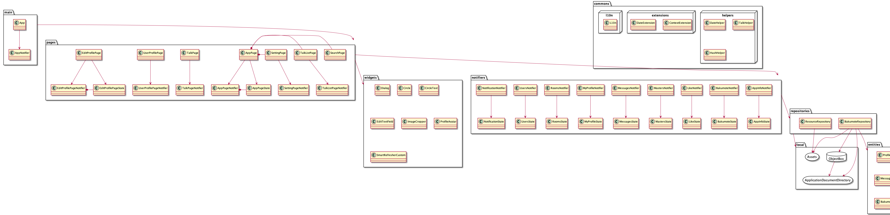

# bakumote

[「マッチングアプリで出会えないから自分ひいきのアプリを1週間で作ったwww」企画](https://www.youtube.com/watch?v=wkYzBdeIT_E)

・YouTubeチャンネル<br>
[貧乏エンジニア社長もくもくさん](https://www.youtube.com/c/mokudev)

チャンネル登録よろしくお願いしますm(__)m

## 設計

クロスプラットフォームフレームワークのFlutterで開発しました。設計は Riverpod + StateNotifier です。



## 使い方

### 確認済みビルド環境

```sh
$ flutter doctor
Doctor summary (to see all details, run flutter doctor -v):
[✓] Flutter (Channel stable, 1.22.0, on Mac OS X 10.15.6 19G2021, locale ja-JP)
 
[✓] Android toolchain - develop for Android devices (Android SDK version 28.0.3)
[✓] Xcode - develop for iOS and macOS (Xcode 12.0.1)
[✓] Android Studio (version 4.0)
[!] IntelliJ IDEA Community Edition (version 2018.3.3)
    ✗ Flutter plugin not installed; this adds Flutter specific functionality.
    ✗ Dart plugin not installed; this adds Dart specific functionality.
[✓] VS Code (version 1.49.2)

! Doctor found issues in 1 category.
```

Flutter SDKとそれをビルドできるIDEが必要です。

[https://flutter.dev/docs/get-started/install](https://flutter.dev/docs/get-started/install)

### 実行

```sh
# Clone source code.
$ git clone https://github.com/hukusuke1007/bakumote.git
$ cd bakumote

# Install plugins.
$ flutter pub get

# Launching with debug version.
$ flutter run

# Launching with release version.
$ flutter run --release

# Launching both iOS and Android with debug version.
$ flutter run -d all
```

### 実装について

freezedとObjectBoxのコード生成コマンドとl10n文言ファイルのコード生成コマンドをshellにまとめている。

```sh
# freezedとObjectBoxのコード生成
./sh/build_runner

# l10n文言ファイルのコード生成
./sh/generate_l10n_message
```

## その他

コードはご自由にお使いください。PRも受け付けています（笑）

## 利用したフリー素材

[ICOOON MONO](https://icooon-mono.com/)

## 参考文献

[Provider, but different | Riverpod](https://riverpod.dev/)

[Flutterの状態管理手法の選定](https://medium.com/flutter-jp/state-1daa7fd66b94)