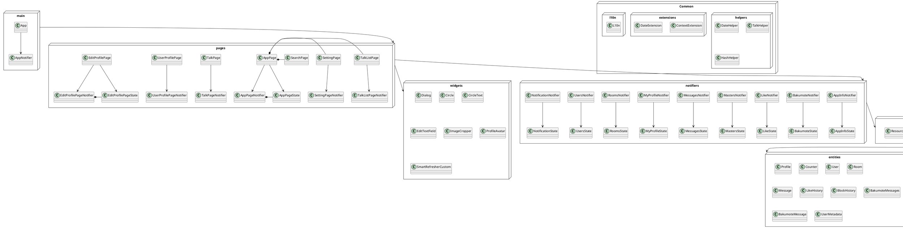

## 爆モテ設計

```plantuml
@startuml
package main <<Node>> {
  class App {}
  class AppNotifier {}
}

package pages <<Node>> {
  class AppPage {}
  class AppPageNotifier {}
  class AppPageState {}
  class SearchPage {}
  class TalkListPage {}
  class TalkListPageNotifier {}
  class SettingPage {}
  class SettingPageNotifier {}
  class TalkPage {}
  class TalkPageNotifier {}
  class UserProfilePage {}
  class UserProfilePageNotifier {}
  class EditProfilePage {}
  class EditProfilePageNotifier {}
  class EditProfilePageState {}
}

package widgets <<Node>> {
  class Dialog {}
  class Circle {}
  class CircleText {}
  class EditTextField {}
  class ImageCropper {}
  class ProfileAvatar {}
  class SmartRefresherCustom {}
} 

package notifiers <<Node>> {
  class AppInfoNotifier {}
  class AppInfoState {}
  class BakumoteNotifier {}
  class BakumoteState {}
  class LikeNotifier {}
  class LikeState {}
  class MastersNotifier {}
  class MastersState {}
  class MessagesNotifier {}
  class MessagesState {}
  class MyProfileNotifier {}
  class MyProfileState {}
  class RoomsNotifier {}
  class RoomsState {}
  class UsersNotifier {}
  class UsersState {}
  class NotificationNotifier {}
  class NotificationState {}

}

package repositories <<Node>> {
  class BakumoteRepository {}
  class ResourceRepository {}
}

package entities <<Node>> {
  class Profile {}
  class Counter {}
  class User {}
  class Room {}
  class Message {}
  class LikeHistory {}
  class BlockHistory {}
  class BakumoteMessages {}
  class BakumoteMessage {}
  class UserMetadata {}
}

package local <<Node>> {
  database ObjectBox {
  }
  storage Assets {
  }
  storage ApplicationDocumentDirectory {
  }
}

package Common <<Node>> {
  package helpers <<Node>> {
    class DateHelper {}
    class TalkHelper {}
    class HashHelper {}
  }

  package extensions <<Node>> {
    class ContextExtension {}
    class DateExtension {}
  }

  package l10n <<Node>> {
    class L10n {}
  }
}


App --> AppNotifier

' 関連
main --> pages
AppPage --> AppPageNotifier
AppPage --> AppPageState
AppPageNotifier *- AppPageState
AppPage *- SearchPage
AppPage *- TalkListPage
AppPage *- SettingPage
TalkListPage --> TalkListPageNotifier
SettingPage --> SettingPageNotifier
TalkPage --> TalkPageNotifier
UserProfilePage --> UserProfilePageNotifier
EditProfilePage --> EditProfilePageNotifier
EditProfilePage --> EditProfilePageState
EditProfilePageNotifier *- EditProfilePageState
pages --> widgets
pages --> notifiers

AppInfoNotifier --> AppInfoState
BakumoteNotifier --> BakumoteState
LikeNotifier --> LikeState
MastersNotifier --> MastersState
MessagesNotifier --> MessagesState
MyProfileNotifier --> MyProfileState
RoomsNotifier --> RoomsState
UsersNotifier --> UsersState
NotificationNotifier --> NotificationState
  
notifiers --> repositories
ResourceRepository --> Assets
BakumoteRepository --> ObjectBox
BakumoteRepository --> Assets

BakumoteRepository --> entities

ObjectBox --> ApplicationDocumentDirectory
BakumoteRepository --> ApplicationDocumentDirectory

@enduml
```